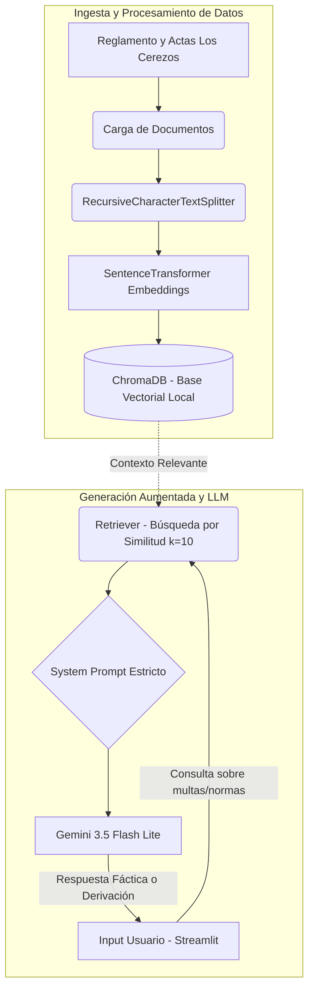

# 🏘️ Asistente RAG para la Comunidad Solidaria Los Cerezos

Sistema de Inteligencia Artificial basado en RAG (Retrieval-Augmented Generation) diseñado para asistir a los residentes de la cooperativa de vivienda **Los Cerezos** (ubicada en Cerro Navia, Santiago) resolviendo consultas basadas estrictamente en los reglamentos de copropiedad y actas de asambleas oficiales.

El sistema opera de forma local, garantizando la privacidad de la información y utilizando modelos de lenguaje de Google Gemini combinados con una base de datos vectorial local (ChromaDB) para evitar alucinaciones.

---

## 🚀 Características Principales
- **Cero Alucinaciones:** Si una respuesta no se encuentra en los documentos oficiales, el asistente aplica un protocolo de derivación empático hacia la directiva.
- **Interfaz Web Interactiva:** Desarrollada con **Streamlit** para simular un chat ciudadano real.
- **Procesamiento Local:** Los documentos se vectorizan e indexan localmente mediante SentenceTransformers y ChromaDB.

---

## 🛠️ Tecnologías Utilizadas
- **Python** (Entorno de desarrollo)
- **LangChain / LangChain Classic** (Orquestador de la arquitectura RAG)
- **Google Gemini (1.5-flash / 3.5-flash)** (Motor de lenguaje natural)
- **ChromaDB** (Base de datos vectorial local)
- **Streamlit** (Interfaz gráfica de usuario)

---

## 🏗️ Arquitectura del Sistema

El siguiente diagrama detalla el flujo de datos, desde la vectorización de los reglamentos hasta la recuperación de contexto y generación de respuestas por parte del LLM.



## 📥 Guía de Instalación y Uso (Paso a Paso)

Sigue estos pasos para clonar y ejecutar la aplicación en tu propio entorno local:

### 1. Clonar el repositorio
Abre tu terminal y ejecuta:
```bash
git clone [https://github.com/TU_USUARIO/rag-cooperativa.git](https://github.com/TU_USUARIO/rag-cooperativa.git)
cd rag-cooperativa

#Crear tu propio entorno virtual (Es recomendado)
python -m venv .venv
# En Windows:
.venv\Scripts\activate
# En Mac/Linux:
source .venv/bin/activate

#Instalar independencias
pip install -r requirements.txt

#Configurar tus credenciales (API KEY GEMINIS)
Crear archivo .env en la raiz del proyecto
GOOGLE_API_KEY=tu_api_key_aqui

#Por ultimo ejecutamos la interfaz Web
streamlit run app.py
#Se abrirá automáticamente una ventana en tu navegador #web con el chat de la cooperativa listo para ser #utilizado.
